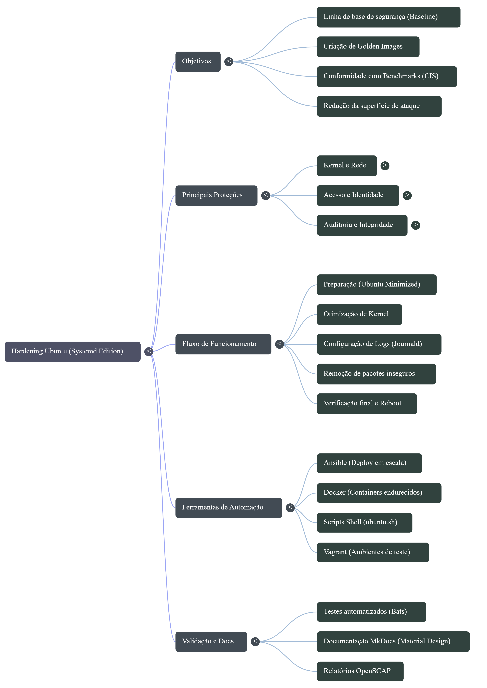
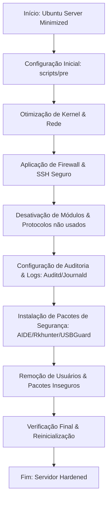

# Ubuntu Hardening (Edição Systemd) 🐧🔒

Este projeto oferece uma maneira rápida e automatizada de tornar um servidor Ubuntu significativamente mais seguro. Ele aplica uma série de configurações de "endurecimento" (hardening) baseadas em benchmarks de segurança e nas melhores práticas da indústria.

---

## 🎯 Objetivo do Projeto


> [!IMPORTANT]
> ### 📽️ [VER APRESENTAÇÃO INTERATIVA (SLIDESHOW)](https://maurocapuanopy-source.github.io/hardening/apresentacao/)
> *Para uma navegação fluida pelo material técnico, acesse nossa versão web interativa.*
O principal objetivo deste projeto é fornecer uma linha de base de segurança (baseline) para novas instalações do Ubuntu Server. Ele transforma uma instalação padrão em uma "imagem dourada" (golden image) que pode ser usada como referência para outros servidores, garantindo que as políticas de segurança sejam seguidas desde o primeiro dia.

### Como ele ajuda?

- **Redução da Superfície de Ataque**: Desativa módulos de kernel desnecessários (ex: Bluetooth, Firewire, tipos de arquivos obsoletos).
- **Conformidade em Segundos**: Aplica configurações que levariam horas para serem feitas manualmente, seguindo recomendações de benchmarks como o CIS (Center for Internet Security).
- **Proteção Ativa**: Configura Firewall (UFW), Proteção Contra Intrusão (PSAD), Auditoria (Auditd) e integridade de arquivos (AIDE).
- **Facilidade de Auditoria**: Inclui uma bateria de testes (Bats) para garantir que as proteções foram aplicadas corretamente.

---

## 🗺️ Mapa Mental do Projeto

Visualize a estrutura do projeto e clique nos links para navegar:

### Visão Geral (Imagem)


### Estrutura Detalhada (Markdown)
```mermaid
mindmap
  root(("🛡️ HARDENING UBUNTU"))
    "🚀 Automação"
      "Ansible (Deploy Escala)"
      "Docker (Imagens Gold)"
      "GitHub Actions (CI/CD)"
    "⚙️ Configurações"
      "Kernel & Rede"
      "Firewall (UFW)"
      "SSH Seguro"
    "📊 Monitoramento"
      "Auditd (Auditoria)"
      "PSAD (Intrusão)"
      "AIDE (Integridade)"
    "🧪 Qualidade"
      "Testes Bats"
```

---

## 🏗️ Fluxo de Funcionamento

O diagrama abaixo ilustra o processo simplificado do script `ubuntu.sh` desde a preparação até a finalização:



---

## 🤖 Automação Profissional

Para facilitar o deploy em escala ou o uso em ambientes modernos, o projeto agora inclui suporte nativo para:

### 1. Ansible (Deploy em Escala)
Perfeito para preparar servidores remotos do zero. O playbook faz o update, instala o SSH e aplica o hardening.
- **Localização**: `ansible/`
- **Comando**: `ansible-playbook -i inventory.ini site.yml`

### 2. Docker (Imagens Golden)
Crie containers Ubuntu já endurecidos para seus apps.
- **Localização**: Raiz do projeto.
- **Comando**: `docker-compose build`

---

## 📚 Documentação Completa (MkDocs)

Para detalhes profundos, guias passo a passo e referência técnica, acesse nossa documentação em formato portal (Material Design):

- **Como visualizar**: Instale o MkDocs e rode `mkdocs serve` ou acesse a pasta `docs/`.

---

## 🚀 Como Usar (Guia Rápido)

### 1. Preparação do Servidor
Comece com uma instalação limpa do **Ubuntu Server (minimized)** (versão 22.04 ou 24.04).
> [!IMPORTANT]
> Teste o script sempre em um ambiente de homologação antes de aplicar em produção. O script **não é idempotente**.

### 2. Instalação de Dependências
```bash
sudo apt-get update
sudo apt-get -y install git net-tools procps --no-install-recommends
```

### 3. Download e Configuração
Clone este repositório e ajuste as opções no arquivo de configuração:
```bash
git clone https://github.com/konstruktoid/hardening.git
cd hardening
# Edite o arquivo ubuntu.cfg (ajuste FW_ADMIN e SSH_GRPS)
nano ubuntu.cfg
```
> [!TIP]
> Não esqueça de atualizar a variável `CHANGEME` no arquivo `ubuntu.cfg`, caso contrário o script falhará por segurança.

### 4. Execução
```bash
sudo bash ubuntu.sh
sudo reboot
```

---

## 📦 Principais Proteções Aplicadas

| Categoria | Descrição |
| :--- | :--- |
| **Kernel** | Hardening de rede via `sysctl` e restrição de módulos (DCCP, SCTP, etc). |
| **Acesso** | SSH restrito, bloqueio de conta `root`, regras de firewall via UFW. |
| **Auditoria** | Auditoria completa de chamadas de sistema com `Auditd` e monitoramento de logs. |
| **Arquivos** | Verificação de integridade sistemática com `AIDE` e `debsums`. |
| **Identidade** | Políticas de senha fortes e limpeza de usuários de sistema desnecessários. |

---

## 🧪 Verificando o Hardening
Após rodar o script e reiniciar, você pode executar os testes automatizados:
```bash
cd tests/
sudo bats .
```
Isso validará centenas de configurações individuais para garantir que seu servidor está em conformidade.

---

## 🛡️ Contribuição
Encontrou algo estranho ou quer sugerir uma melhoria? Sinta-se à vontade para abrir uma [Issue](https://github.com/konstruktoid/hardening/issues/) ou enviar um Pull Request.

---

