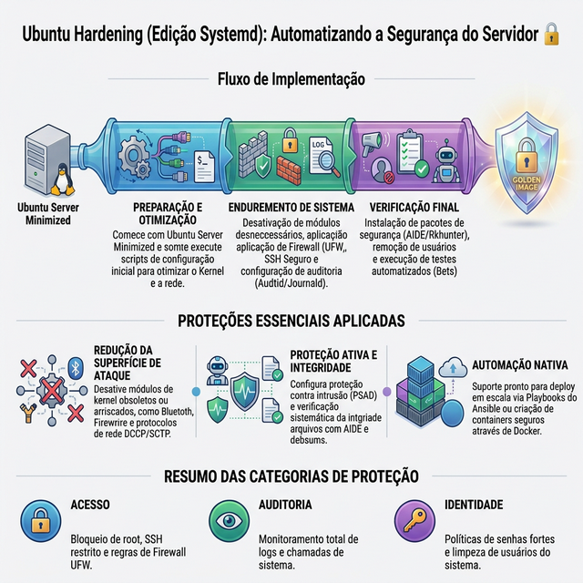
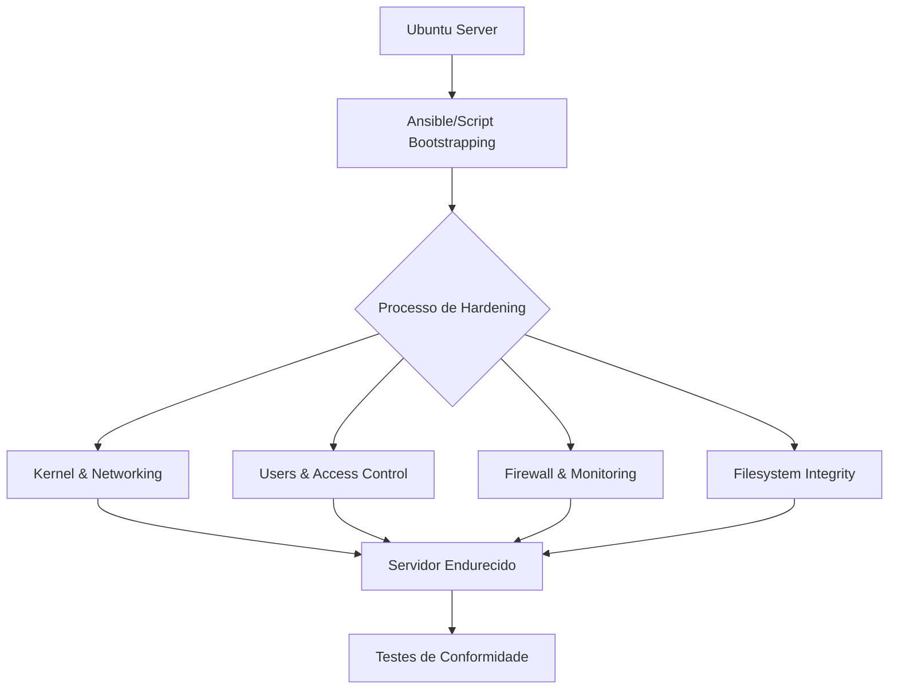

# Hardening Ubuntu 🐧🔒

Bem-vindo à documentação oficial do projeto **Hardening Ubuntu (Edição Systemd)**.

Este projeto oferece uma maneira rápida e automatizada de tornar um servidor Ubuntu significativamente mais seguro, aplicando uma série de configurações baseadas em benchmarks de segurança e melhores práticas.

## 🎯 Por que usar este projeto?

Manter servidores Linux seguros requer atenção a centenas de detalhes, desde permissões de arquivos até parâmetros de rede no kernel. Este projeto automatiza esse processo difícil e propenso a erros.

### Como ele ajuda:

- **Redução da Superfície de Ataque**: Desativa o que você não usa.
- **Conformidade**: Segue recomendações do benchmark CIS.
- **Automação Profissional**: Suporte nativo para **Ansible** e **Docker**.
- **Auditoria**: Vem com mais de 700 testes automatizados.

---

## 🗺️ Mapa Mental do Projeto

Abaixo apresentamos uma visão geral interativa das capacidades deste projeto:

- [**🛡️ HARDENING UBUNTU**](#)
    - [**🚀 Automação**](guia-ansible.md)
        - [Ansible (Deploy)](guia-ansible.md)
        - [Docker (Imagens)](guia-docker.md)
    - [**⚙️ Segurança de Sistema**](manual.md)
        - [Kernel & Networking](manual.md#kernel-fsysctl)
        - [Controles de Acesso](manual.md#acesso-e-identidade)
    - [**📊 Monitoramento**](manual.md#monitoramento-e-auditoria)
        - [Auditd](manual.md#monitoramento-e-auditoria)
        - [Integridade AIDE](manual.md#referencia-tecnica)

---

## 📊 Infográfico de Segurança

---

## 🏗️ Fluxo de Hardening

Navegue pelas seções lateral para aprender como usar a automação com Ansible ou como construir imagens Docker endurecidas.
