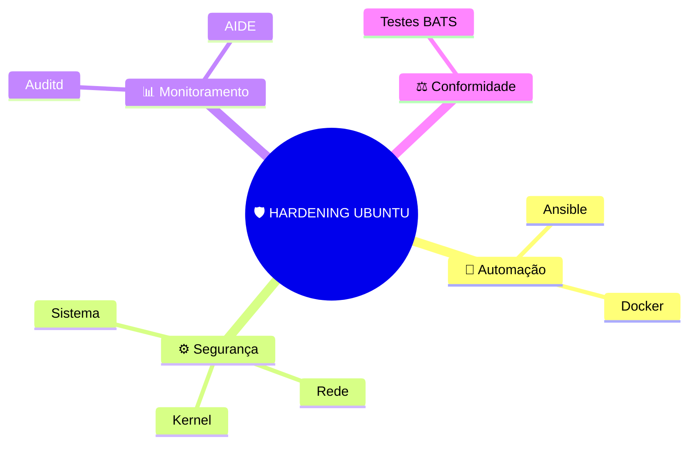
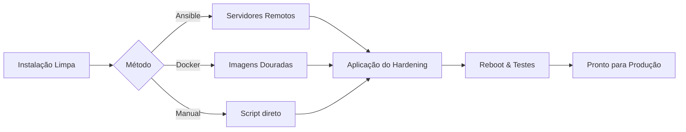

# Hardening Ubuntu Docs 🐧🔒

Bem-vindo à documentação oficial do projeto **Hardening Ubuntu (Edição Systemd)**. Este portal oferece um guia completo para transformar seu servidor Linux em uma fortaleza digital.

---

## 🚀 Comece por aqui

/// grid | cards

-   :material-lightning-bolt:{ .lg .middle } __Quick Start__

    ---

    Aprenda a rodar o projeto em segundos em um novo servidor.

    [:octicons-arrow-right-24: Ver Guia](guias/quick-start.md)

-   :material-book-open-variant:{ .lg .middle } __Detalhes Técnicos__

    ---

    Entenda cada camada de proteção e como ela blinda seu sistema.

    [:octicons-arrow-right-24: Ver Proteções](protecoes/kernel.md)

-   :material-robot-confused:{ .lg .middle } __Automação__

    ---

    Integre com Ansible ou Docker para criar imagens douradas.

    [:octicons-arrow-right-24: Ver Automação](guia-ansible.md)

-   :material-chart-bell-curve-cumulative:{ .lg .middle } __Verificação__

    ---

    Valide se o seu servidor está realmente seguro com testes reais.

    [:octicons-arrow-right-24: Ver Testes](guias/testes.md)

///

---

## 🗺️ Mapa Mental do Projeto

---

## 🏗️ Fluxo de Operação

